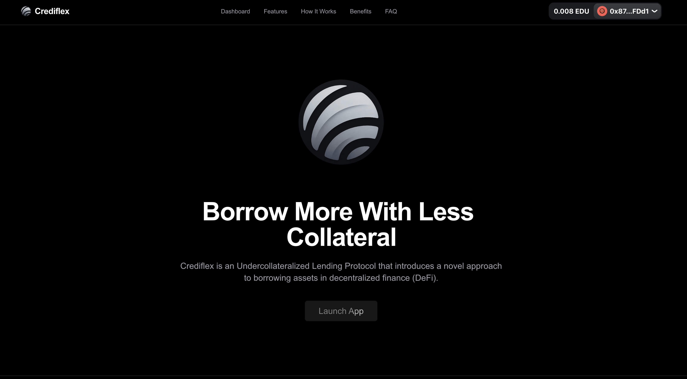
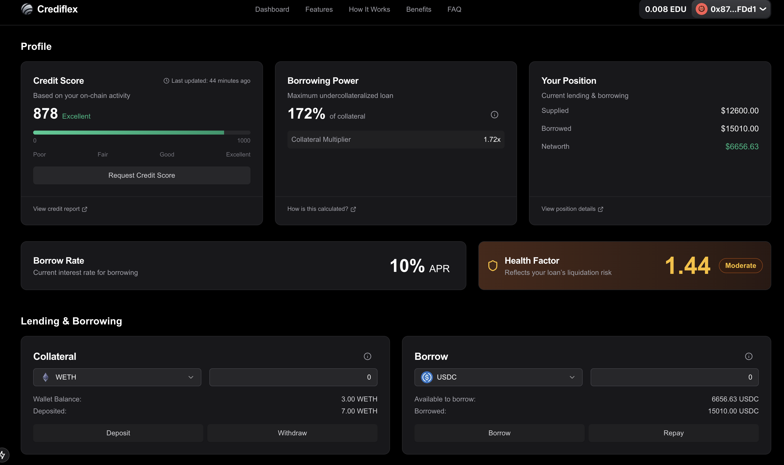

# Crediflex

**Crediflex** is an **Undercollateralized Lending Protocol** that introduces a novel approach to borrowing assets in decentralized finance (DeFi). By leveraging on-chain activity-based credit scoring, it enables users to borrow more assets than they collateralize, provided certain requirements are met.

---

## Problem Statement

Traditional lending protocols in DeFi face a significant limitation:

- **Overcollateralization Requirement**: Users must deposit more collateral than the amount they intend to borrow.

This restrictive model limits capital efficiency and discourages broader adoption of lending platforms.

---

## Proposed Solution

Crediflex addresses this issue with an **undercollateralized approach**, allowing users to borrow assets with collateral worth less than the borrowed amount. The key innovation lies in the integration of **on-chain credit scoring** to determine dynamic loan-to-value (LTV) ratios.

---

## What is Crediflex?

Crediflex is an undercollateralized lending protocol that leverages **AVS (Actively Validated Service)** with **EigenLayer middleware** to verify credit scoring and **zkTLS** to fetch proofed data for calculating C Score parameters.

- The **C Score** dynamically determines Loan-to-Value (LTV) ratios, enabling users to borrow more than their collateral based on their on-chain activities.
- For the hackathon, users deposit **mock WETH** as collateral and borrow **mock USDe** as the asset, with borrowing limits calculated using updated parameters:
  1. **Wallet Age Score**: Based on how long the wallet has been active.
  2. **Transaction Activity Score**: Based on the number of transactions the wallet has performed.
  3. **Token Diversity Score**: Based on the number of unique tokens worth more than $1 held.
  4. **ENS Ownership Score**: Based on the ownership of ENS domains.
  5. **NFT Ownership Score**: Based on the ownership of NFTs.

This implementation showcases **secure data handling**, **efficient scoring**, and practical lending mechanics for DeFi.

---

## Deployment

Crediflex is deployed on the **EDU Chain testnet**, while the credit scoring parameters are derived from **Arbitrum Mainnet activity**. This approach ensures realistic data is used for parameter calculation while maintaining a test environment for rapid development and validation.

---

## Links

- **Demo Video**: [Watch here](https://youtu.be/O3tfCLKBoOc)
- **Slide Deck**: [Google Slides](https://docs.google.com/presentation/d/1jzdRC5VvygoHkkKyZcC22kcvkAqC7YxsAfnADTBuLmU/edit#slide=id.g1f1ce5643d3_0_0)
- **Web App**: [Crediflex App](https://crediflex-fi.vercel.app/)

---

## Credit Scoring (C Score)

The **C Score** is a unique metric that evaluates a user’s on-chain activity using specific parameters. While there are plans to integrate many parameters in the future, the hackathon version of Crediflex uses the five parameters mentioned above.

---

### AVS and zkTLS in Action

1. **AVS (Actively Validated Service)**:

   - Manages credit scoring requests.
   - Uses **EigenLayer middleware** to verify tasks securely.
   - Enables on-chain verification of off-chain data fetching and score computation.

2. **zkTLS**:
   - Fetches proofed and verifiable data from HTTPS endpoints.
   - Prevents tampering during data-fetching.
   - Ensures accurate, trustless data ingestion for score computation.

---

## Workflow

### Credit Scoring Workflow

1. The user initiates a request for a **C Score** through the **AVS contract**.
2. The AVS contract generates a credit scoring task.
3. An **Operator** accepts the task.
4. The Operator collects on-chain data from **Alchemy** to acquire the necessary information for score computation.
5. The Operator also retrieves remote data over HTTPS, secured with **zkTLS**.
6. The gathered data is processed to compute the C Score.
7. The computed score is signed and verified using **EigenLayer middleware**.
8. The verified score is uploaded as a certificate to **Pinata** for decentralized storage.
9. The certificate is accessed using **zkTLS** to confirm its integrity and ensure it has not been tampered with.
10. The final score is returned to the AVS contract.

**Note**: The C Score is valid for **120 days**. After this period, users must request a new score.

### Lending Workflow

1. Users deposit **mock WETH** as collateral.
2. Users can borrow **mock USDe** based on their C Score-determined LTV.

---

## Use Cases: Empowering Education with On-Chain Credit

Crediflex integrates with **EDU Chain** to bring new opportunities to learners and educators via inclusive, decentralized credit.

### 🎓 1. Student Loans for Higher Education

Borrow tuition or living expenses with on-chain academic credentials as proof of credibility.

### 📚 2. Microloans for Skill Development

Access capital for bootcamps, certifications, or online learning. Improve your C Score as you learn.

### 🧾 3. Deferred Tuition Financing

Institutions can offer “study now, pay later” with repayment governed transparently by C Score.

### 🧠 4. Educator & Contributor Credit Access

Instructors and contributors can qualify for loans based on their verified contributions.

Crediflex builds a financial foundation that’s **transparent**, **earned**, and **on-chain**.

---

## Smart Contracts

- **Main Contract**: [0xB5826abe2d27Fe01CdC98b394293Ead4f9f42883](https://edu-chain-testnet.blockscout.com/address/0xB5826abe2d27Fe01CdC98b394293Ead4f9f42883)
- **AVS Contract**: [0xb9a051f8fba685b18415150090afc61fe4500fab](https://edu-chain-testnet.blockscout.com/address/0xb9a051f8fba685b18415150090afc61fe4500fab)
- **Mocks**:
  - **usdcUsdDataFeed**: [0x36Cd512c939af6a9340bC826c70af947a7c86845](https://edu-chain-testnet.blockscout.com/address/0x36Cd512c939af6a9340bC826c70af947a7c86845)
  - **wethUsdDataFeed**: [0xEfA79f90A2a9400A32De384b742d22524c4A69d5](https://edu-chain-testnet.blockscout.com/address/0xEfA79f90A2a9400A32De384b742d22524c4A69d5)
  - **usdc**: [0xF4a005844b3Da4313bc2F3059445D615cF4D7074](https://edu-chain-testnet.blockscout.com/address/0xF4a005844b3Da4313bc2F3059445D615cF4D7074)
  - **weth**: [0xB5479eab222051E86370E1d99aD93d304eC7EFba](https://edu-chain-testnet.blockscout.com/address/0xB5479eab222051E86370E1d99aD93d304eC7EFba)

## Technology Stack

- **AVS (Actively Validated Service)**: Manages credit scoring requests and verifies responses using middleware for task validation.
- **zkTLS**: Ensures data fetched from HTTPS endpoints is verifiable and tamper-proof.
- **EigenLayer Middleware**: Provides secure and trustless task verification for C Score calculations.
- **Mock Contracts**: Simulated **USDe** and **WETH** contracts for testing borrowing and collateral features.
- **Pinata**: Utilized for uploading certificates using IPFS for decentralized storage.
- **Alchemy**: Provides on-chain data access and management for enhanced protocol functionality.
- **EDU Chain Testnet**: Deployment environment for contracts and protocol validation.

For more information, feel free to explore the **contracts**, visit the **web app**, or contact the team!

## Future Plans

1. **KYC Integration**: Prevent Sybil attacks via identity linking.
2. **Expanded Credit Scoring**:
   - DeFi interaction history
   - Loan repayment behavior
   - Liquidation patterns
3. **Score Algorithm Upgrades**: Enhance precision and transparency.
4. **Asset and Chain Support**: Broaden protocol utility.
5. **Real-Time Monitoring**: Auto-refresh C Scores based on new on-chain activity.

---

## License

MIT License

---

For more details, explore the contracts, visit the app, or contact the team!
